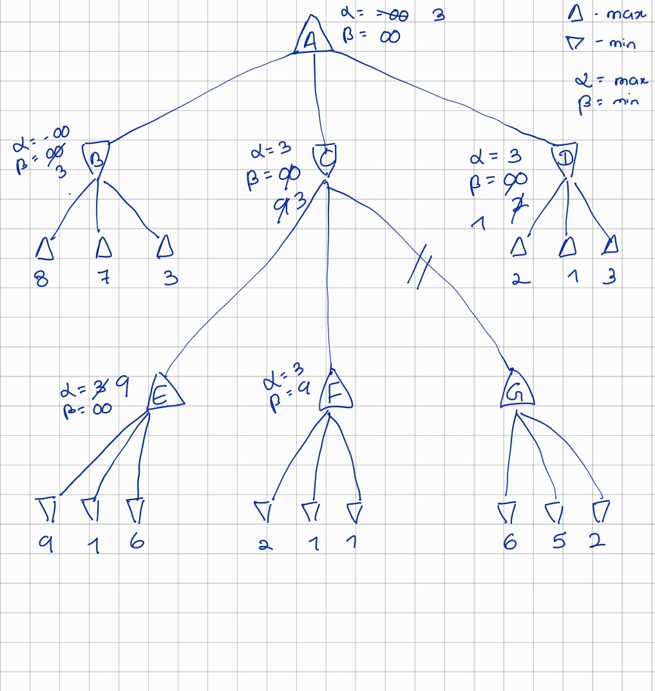
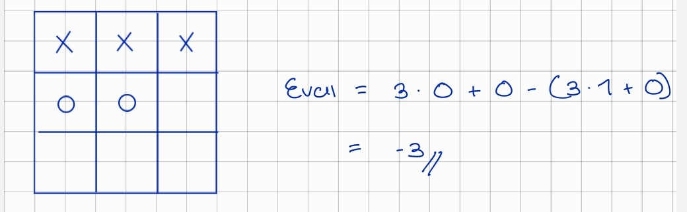
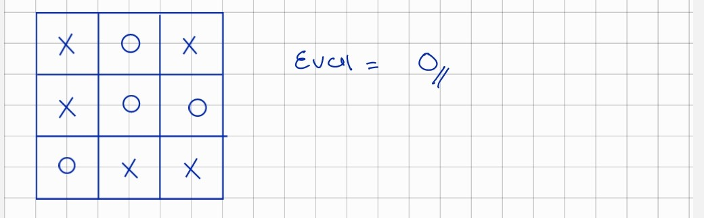
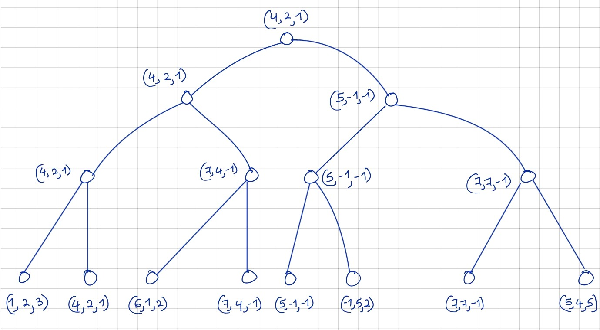

__MiniMax Algorithmen__ 

__Aufgabe 1 : Handsimulation - MiniMax und Alpha-Beta-Pruning__

_1.1 Bewertung_

B = min(8,7,3) => 3

E = max(9,1,6) => 9

F = max(2,1,1) => 2

G = max(6,5,2) => 6

C = min(E,F,G) => 2

D = min(2,1,3) => 1

A = max(B,C,D) => 3

_1.2 Bild_:

 

_1.3 Knoten Ordnen_

Hier bin ich mir nicht sicher, aber ich würde aus folgende Gründen Nein sagen ( wie gesagt nicht sicher ):
Wenn die Nachfolger Knoten in dem Suchbaum bereits festgelegt sind.
Wenn der Baum vollständig expandiert sind.

__Aufgabe 2 : Optimale Spiele – MiniMax und alpha-Beta Pruning__

In der tictactoeminimax.py Datei ist die MiniMax implementierung für das Tic Tac Toe Spiel.

__Aufgabe 3 : MiniMax vereinfachen__

Die Funktion MaxValue wird aufgerufen, wenn der aktuelle Spieler gewinnen will.

Die Funktion MinValue wird aufgerufen, wenn der Gegner am Zug ist.

Bei der Nullsummenspiel geht es darum, dass die Punkte, die ein Spieler gewinnt, verliert der andere Spieler.
Das bedeutet, die summe aus  Gewinn und Verlust soll gleicht null sein:

Gewinn + ( - Verlust ) = 0

 
Meine Vermutung, den Vorzeichen wechseln, wenn der Gegner am Zug ist. Danach den best_value mit den bisherigen value vergleichen und den maximalen Wert aus den beiden Werten zurückgeben. 

Im Folgenden ist ein Beispielbaum:

 

__Aufgabe 4 : Suchtiefe begrenzen__

Wir sollten hier die Evaluierungsfunktion auf sechs verschiedene Spielzustände anwenden. 3 x Endzustände und 3 x Zwischen Zustände.

X ist der menschlichen Spieler und O ist der KI-Agent

Wenn O gewinnt:

 
Wenn X gewinnt:

Wenn unentschieden:

 
3 Zwischen Spielzustände:

 

Warum könnte diese Evalierungsfunktion Sinnvoll sein:

Es ist einfach und schnell zu berechnen, weil wir nur 8 mögliche Rhein überprüfen muss. Das heißt 3 x Zeilen, 3 x Spalten und 2 x Diagonal.

Man kann mit dieser Funktion noch bestimmen wie nah man am Gewinn ist. Wenn zwei gleiche Zeichen in einer Reihe sind, ist fast wie ein Sieg.

__Aufgabe 5 : MiniMax generalisiert__

Jeder Spieler will seinen Wert maximieren, also in jede Ebene nach dem maximalen Wert suchen.

 
 
